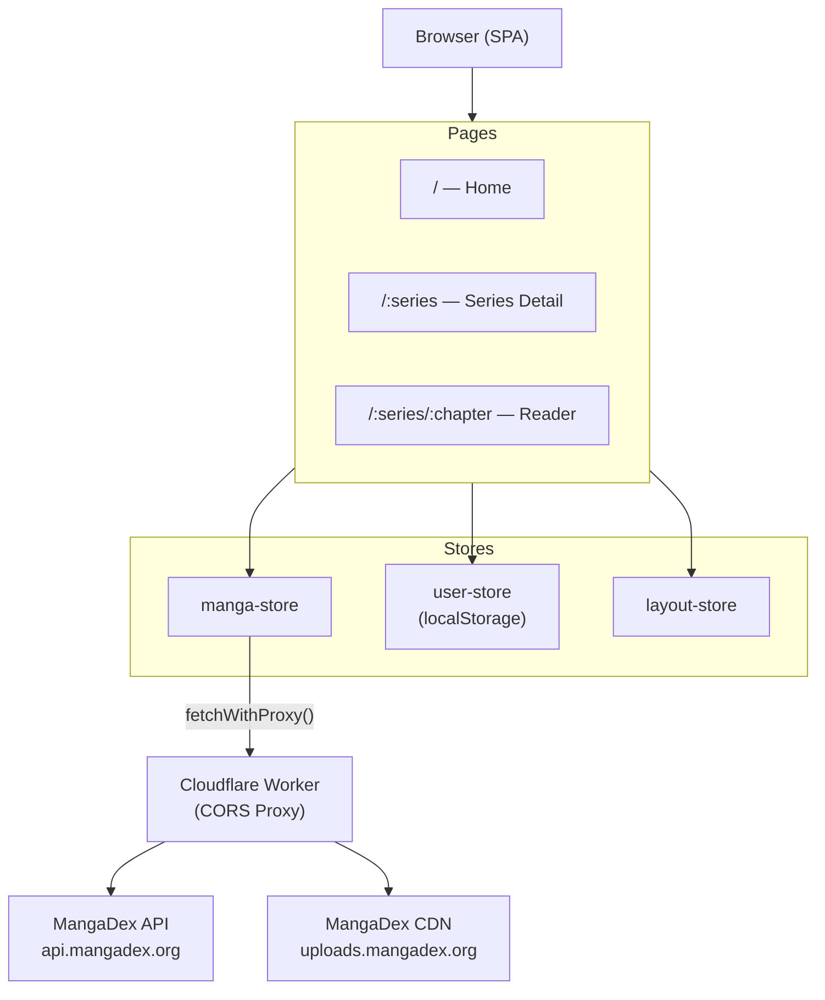

# Zen Manga

A minimalist, client-side manga reader built on [MangaDex](https://mangadex.org). Deployed as a Progressive Web App to GitHub Pages.

## Features

- Browse latest updates, newest additions, and popular picks from MangaDex
- Search manga by title with tag-based filtering (genre, status, demographic, content rating)
- Series detail pages with paginated chapter lists grouped by volume
- Chapter reader with auto-hiding header/nav on scroll
- Favorites and reading history stored locally (no account required)
- Web Comic / Long Strip mode for vertical strip manga

## Tech Stack

- **[Nuxt 4](https://nuxt.com)** — SPA mode (SSR disabled), hash-based routing, deployed to GitHub Pages
- **[Pinia](https://pinia.vuejs.org)** — state management
- **[@vite-pwa/nuxt](https://vite-pwa-org.netlify.app/frameworks/nuxt)** — PWA support
- **[MangaDex API](https://api.mangadex.org/docs/)** — manga data source
- **Cloudflare Worker proxy** — CORS bypass for browser-to-MangaDex requests

## Architecture



### API Layer (`app/utils/`)
All MangaDex API calls go through `mangadex.ts`, which wraps every request in `fetchWithProxy` (`fetch-with-proxy.ts`). A Cloudflare Worker at `corsproxy.10jmellott.workers.dev` proxies all requests to bypass CORS — the browser cannot hit `api.mangadex.org` directly. Cover images and chapter pages are also routed through this proxy via `transformForProxy`.

`mangadex.ts` handles the full transformation from raw MangaDex API shapes into the app's `Manga`, `MangaChapter`, and `MangaTag` types (defined in `app/types/manga.ts`). Raw Mangadex interfaces are defined privately at the bottom of that file and never leak out.

### State Management (`app/stores/`)
Three Pinia stores handle all app state:

| Store | Responsibility |
|---|---|
| `manga-store` | Fetched manga data: lists, current series, chapter images, search results. Paginates chapter fetching in batches of 100; skips re-fetching if the current manga ID already matches. |
| `user-store` | All user state persisted to `localStorage`: recently read series (capped at 32), favorites, and per-series read chapter tracking (keyed as `read_<seriesId>`). |
| `layout-store` | Header/nav visibility with scroll-based auto-hide. Only hides on chapter routes, after a 50px scroll delta. Initialized once in `app.vue`. |

### Routing (`app/pages/`)
| Route | Page |
|---|---|
| `/` | Home — horizontal scrollable lists of latest/newest/popular/recent/favorite manga |
| `/:series` | Series detail — cover, metadata, paginated chapter list grouped by volume |
| `/:series/:chapter` | Chapter reader — vertical image strip; tapping anywhere toggles header/nav |

Both params are MangaDex UUIDs. The app uses hash-based routing (`/#/...`) for GitHub Pages compatibility.

### Layout (`app/app.vue`)
The sticky header and bottom nav are always in the DOM. Visibility is toggled via CSS `opacity` and `pointer-events` (not `v-if`) to avoid layout reflow. On chapter routes the `.padded` class is removed from `<main>` so images fill edge-to-edge.

### Styling
Global CSS variables live in `app/assets/styles/theme.css`. Key tokens: `--spacing` (16px), `--padding` (8px), `--border-radius` (8px), `--primary`, `--background`, `--card-background`, `--foreground`. Typography classes (`.h1`–`.h4`, `.body1`–`.body2`, `.caption1`–`.caption2`) are defined in `typography.css`. Global utility classes: `.muted`, `.glass`, `.card`, `.hide-scrollbar`, `.fade-animation`/`.fade`. Icons use `@nuxt/icon` (e.g. `<Icon name="fe:heart" />`).

## Development

```bash
pnpm install
pnpm dev      # http://localhost:8086
pnpm build    # GitHub Pages build
```

